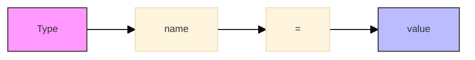
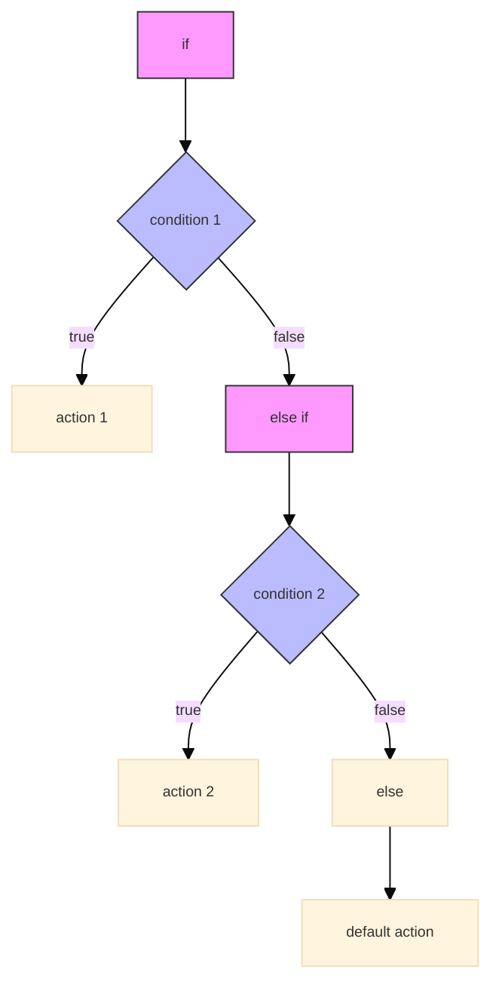
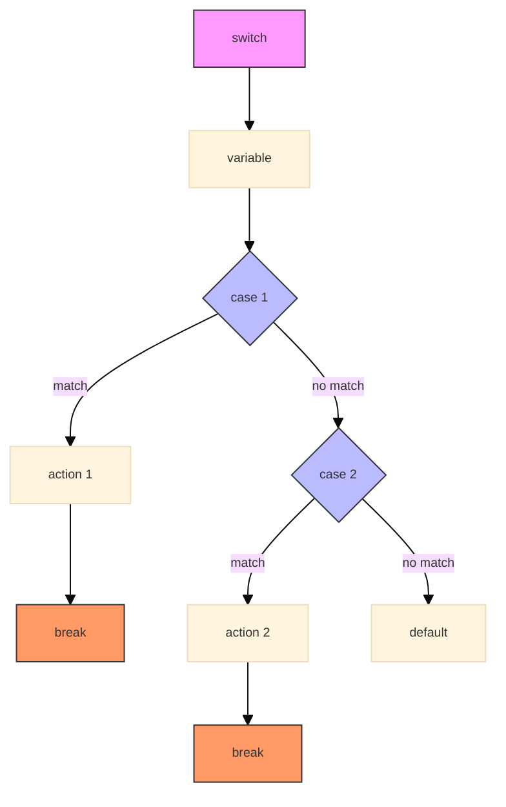
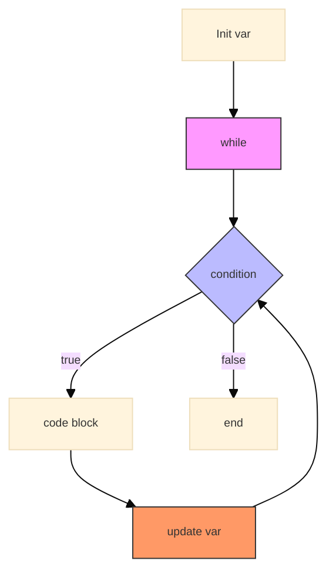
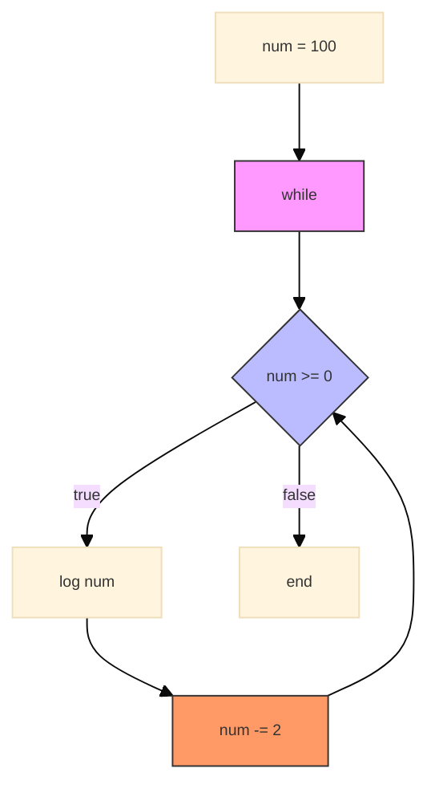
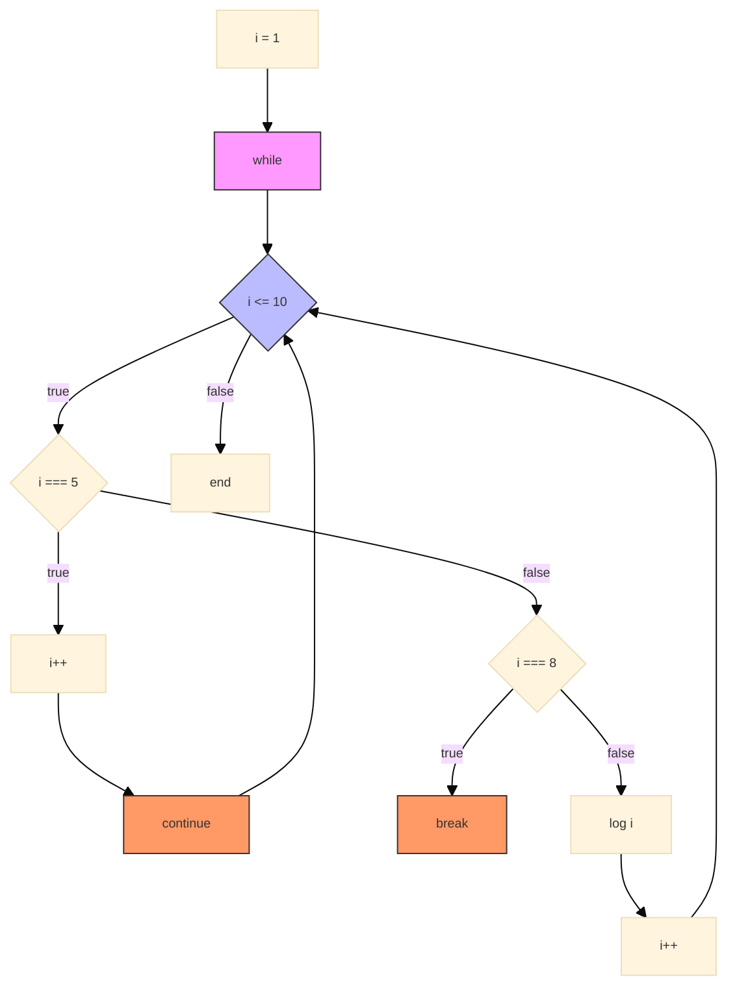

## Topic 1: Complex Conditional Patterns

<div class="arabic">
أنماط الشروط المتقدمة في جافاسكريبت
</div>

### Variable Declarations

**[إعلان المتغيرات]**

```javascript
let number = 10;      // قيمة قابلة للتغيير
const PI = 3.14159;   // قيمة ثابتة لا يمكن تغييرها
```

<div class="arabic">
في جافاسكريبت، ثلاث طرق لإعلان المتغيرات: let للمتغيرات التي قد تتغير قيمتها، const للثوابت التي لا تتغير، و var وهي الطريقة القديمة التي لا ينصح باستخدامها في الكود الحديث
</div>



### If-Else If-Else Statement

**[جملة if-else if-else]**

```javascript
let score = 85;

if (score >= 90) {
    console.log("ممتاز");
} else if (score >= 80) {
    console.log("جيد جدا");
} else if (score >= 70) {
    console.log("جيد");
} else {
    console.log("بحاجة إلى تحسين");
}
```

<div class="arabic">
تستخدم جملة if-else if-else عندما نريد فحص عدة شروط بالترتيب. يتم تنفيذ الكود المرتبط بأول شرط صحيح فقط
</div>



### Switch Statement

**[جملة التبديل]**

```javascript
let day = "Tuesday";

switch (day) {
    case "Monday":
        console.log("بداية الأسبوع");
        break;
    case "Friday":
        console.log("نهاية الأسبوع");
        break;
    default:
        console.log("أيام الأسبوع العادية");
}
```

<div class="arabic">
جملة switch تستخدم عندما نريد مقارنة قيمة واحدة بعدة قيم مختلفة. أكثر تنظيماً من استخدام عدة if/else
</div>



## Topic 2: Loops in JavaScript

<div class="arabic">
الحلقات التكرارية في جافاسكريبت
</div>

### While Loop

**[while loop]**

```javascript
let counter = 10;

while (counter == 10) {
    console.log(counter);
    counter = counter - 1;
}
```

<div class="arabic">
حلقة while تستمر في التنفيذ طالما الشرط صحيح. يجب تغيير قيمة الشرط داخل الحلقة لتجنب الحلقات اللانهائية
</div>



### Countdown With While Loop

**[العد التنازلي باستخدام حلقة while]**

```javascript
let num = 100;
while (num >= 0) {
    console.log(num);
    num = num - 2;
}
```

<div class="arabic">
يمكننا استخدام حلقة while للعد التنازلي، مثل هذا المثال الذي يعد تنازلياً من 100 إلى 0 بخطوات من 2
</div>



### Loop Control

**[التحكم في الloops ]**

```javascript
let i = 1;
while (i <= 10) {
    if (i === 5) {
        i++; // تخطي الرقم 5
        continue;
    }
    if (i === 8) {
        break; // الخروج من الحلقة عند الوصول للرقم 8
    }
    console.log(i);
    i++;
}
```

<div class="arabic">
يمكننا استخدام break للخروج من الحلقة، و continue لتخطي الدورة الحالية والانتقال للدورة التالية
</div>



## Practical Exercise

<div class="arabic">
تمرين عملي: طباعة جدول الضرب
</div>

```javascript
// طباعة جدول ضرب الرقم 5
let number = 5;

for (let i = 1; i <= 10; i++) {
    console.log(number + " × " + i + " = " + (number * i));
}
```

## Key Concepts Covered

<div class="arabic">
المفاهيم الرئيسية التي تم تغطيتها
</div>

1. **إعلان المتغيرات**: استخدام let و const و var
2. **جملة if-else if-else**: فحص عدة شروط بالترتيب
3. **جملة switch**: طريقة منظمة للتحقق من عدة قيم
4. **while**: تنفيذ كود بشكل متكرر طالما الشرط صحيح
5. **التحكم في الحلقات**: استخدام break و continue للتحكم في سير الحلقات


