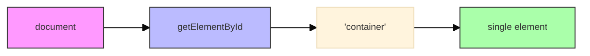
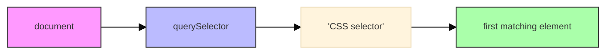
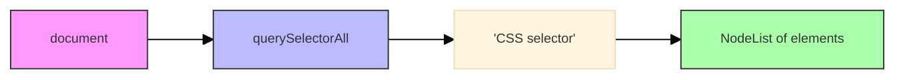
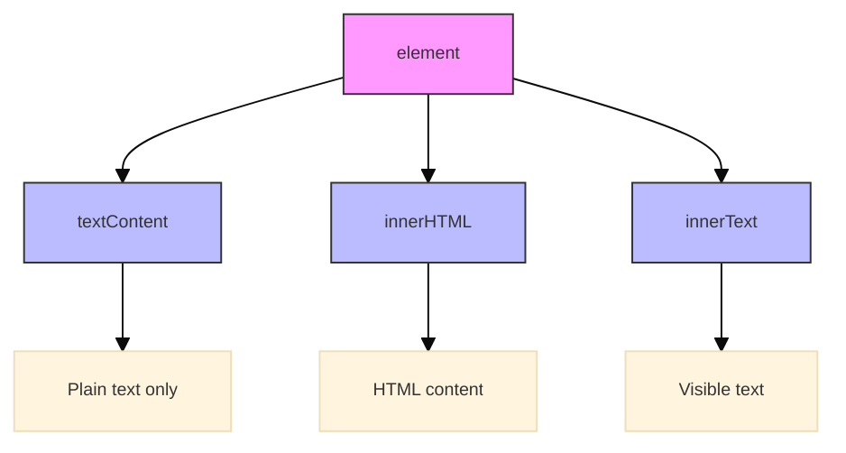
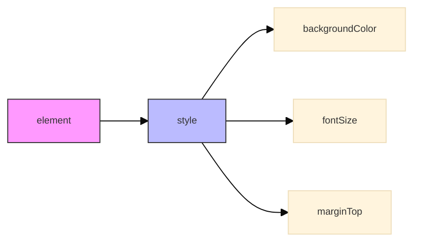
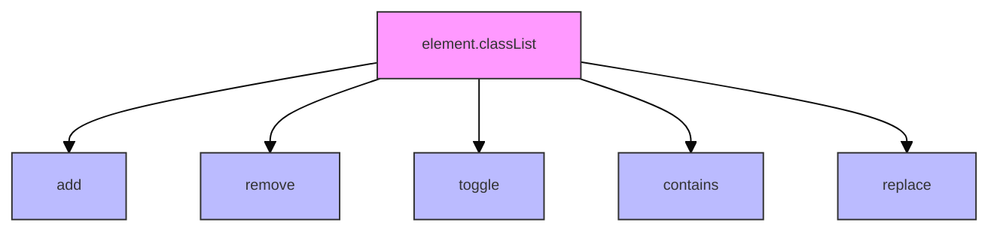
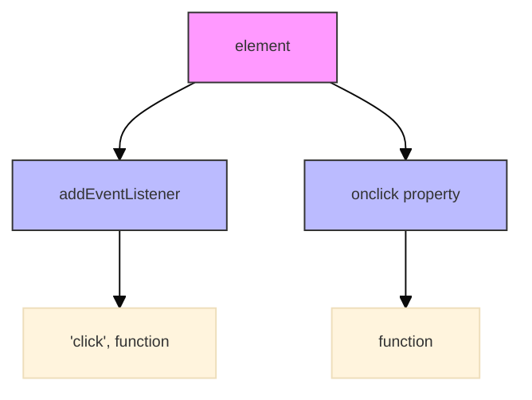
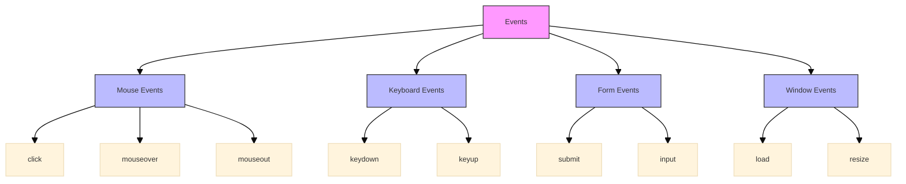

## Topic 1: Basic DOM Selectors

<div class="arabic">
محددات DOM الأساسية
</div>

### getElementById

**[الحصول على عنصر بواسطة المعرف]**

```javascript
// HTML: <div id="container">محتوى</div>

// الحصول على العنصر بواسطة المعرف
const container = document.getElementById('container');

// التحقق من وجود العنصر قبل استخدامه
if (container) {
    console.log(container.textContent); // طباعة محتوى النص
}
```

<div class="arabic">
تستخدم طريقة getElementById للحصول على عنصر واحد فقط باستخدام قيمة خاصية id
</div>



### querySelector

**[محدد الاستعلام]**

```javascript
// الحصول على أول عنصر يطابق المحدد CSS
const firstButton = document.querySelector('button');
const redElement = document.querySelector('.red-text');
const formInput = document.querySelector('#contact-form input');

// يمكنك استخدام محددات CSS معقدة
const nestedElement = document.querySelector('div.container > ul > li:first-child');
```

<div class="arabic">
تستخدم querySelector للحصول على أول عنصر يطابق محدد CSS. يمكن استخدام أي محدد CSS، مما يجعلها أكثر مرونة من getElementById
</div>



### querySelectorAll

**[محدد الاستعلام للحصول على جميع العناصر]**

```javascript
// الحصول على جميع العناصر التي تطابق المحدد CSS
const allParagraphs = document.querySelectorAll('p');
const redElements = document.querySelectorAll('.red-text');

// استخدام الحلقة للتفاعل مع كل عنصر
allParagraphs.forEach(paragraph => {
    console.log(paragraph.textContent);
});

// يمكن أيضًا استخدام for...of
for (const element of redElements) {
    element.style.color = 'darkred'; // تغيير اللون
}
```

<div class="arabic">
تستخدم querySelectorAll للحصول على جميع العناصر التي تطابق محدد CSS. تعيد NodeList التي يمكن التكرار عليها باستخدام forEach أو for...of
</div>



## Topic 2: Modifying Content and Styles

<div class="arabic">
تعديل المحتوى والأنماط
</div>

### Changing Text Content

**[تغيير محتوى النص]**

```javascript
const paragraph = document.querySelector('p');

// طريقة 1: استخدام textContent (النص فقط)
paragraph.textContent = 'هذا نص جديد';

// طريقة 2: استخدام innerHTML (يمكن أن يتضمن HTML)
paragraph.innerHTML = 'هذا <strong>نص</strong> منسق';

// طريقة 3: innerText (مشابهة لـ textContent لكن مع بعض الاختلافات)
paragraph.innerText = 'محتوى نصي جديد';
```

<div class="arabic">
هناك عدة طرق لتغيير محتوى العناصر، منها textContent (للنص العادي)، innerHTML (للنص مع HTML)، وinnerText (وسط بينهما)
</div>



### Modifying Styles

**[تعديل الأنماط]**

```javascript
const div = document.querySelector('.content');

// تعديل نمط مباشرة
div.style.backgroundColor = 'lightblue';
div.style.color = '#333';
div.style.padding = '10px';
div.style.borderRadius = '5px';

// ملاحظة: خصائص CSS ذات الواصلات تستخدم camelCase في JavaScript
// مثال: background-color تصبح backgroundColor
```

<div class="arabic">
يمكن تعديل أنماط CSS للعناصر باستخدام خاصية style. لاحظ أن أسماء خصائص CSS التي تحتوي على واصلات (-) تكتب بنمط camelCase في JavaScript
</div>



### CSS Classes Manipulation

**[التعامل مع فئات CSS]**

```javascript
const element = document.querySelector('.item');

// إضافة فئة
element.classList.add('highlight');

// إزالة فئة
element.classList.remove('inactive');

// تبديل فئة (إضافة إذا لم تكن موجودة، وإزالة إذا كانت موجودة)
element.classList.toggle('selected');

// التحقق من وجود فئة
if (element.classList.contains('active')) {
    console.log('العنصر نشط');
}

// استبدال فئة بأخرى
element.classList.replace('old-class', 'new-class');
```

<div class="arabic">
توفر واجهة classList طرقًا سهلة للتعامل مع فئات CSS للعناصر، مثل إضافة وإزالة وتبديل والتحقق من وجود فئات
</div>



## Topic 3: Basic Event Handling

<div class="arabic">
التعامل مع الأحداث الأساسية
</div>

### Click Events

**[أحداث النقر]**

```javascript
const button = document.querySelector('#submitBtn');

// طريقة 1: استخدام addEventListener
button.addEventListener('click', function() {
    console.log('تم النقر على الزر!');
    alert('تم النقر على الزر!');
});

// طريقة 2: استخدام خاصية onclick
button.onclick = function() {
    console.log('تم النقر على الزر باستخدام onclick!');
};

// دالة منفصلة للتعامل مع الحدث
function handleButtonClick(event) {
    console.log('تم النقر!', event);
    // الوصول إلى العنصر الذي أثار الحدث
    console.log('العنصر:', event.target);
}

// إضافة المعالج
button.addEventListener('click', handleButtonClick);
```

<div class="arabic">
يمكن التعامل مع أحداث النقر وغيرها من أحداث المستخدم باستخدام addEventListener أو خصائص مثل onclick. توفر addEventListener مرونة أكبر وتسمح بإضافة معالجات متعددة للحدث نفسه
</div>



### Common Events

**[الأحداث الشائعة]**

```javascript
const input = document.querySelector('input');
const form = document.querySelector('form');
const div = document.querySelector('div');

// أحداث النموذج
form.addEventListener('submit', function(event) {
    event.preventDefault(); // منع السلوك الافتراضي (إرسال النموذج)
    console.log('تم إرسال النموذج!');
});

// أحداث الإدخال
input.addEventListener('input', function() {
    console.log('قيمة الإدخال:', this.value);
});

// أحداث الفأرة
div.addEventListener('mouseover', function() {
    this.style.backgroundColor = 'yellow';
});

div.addEventListener('mouseout', function() {
    this.style.backgroundColor = '';
});

// أحداث لوحة المفاتيح
document.addEventListener('keydown', function(event) {
    console.log('تم الضغط على المفتاح:', event.key);
});
```

<div class="arabic">
هناك العديد من أنواع الأحداث التي يمكن التعامل معها، مثل أحداث النموذج (submit)، وأحداث الإدخال (input)، وأحداث الفأرة (mouseover, mouseout)، وأحداث لوحة المفاتيح (keydown)
</div>



## Key Concepts Covered

<div class="arabic">
المفاهيم الرئيسية التي تم تغطيتها
</div>

1. **محددات DOM**: استخدام getElementById وquerySelector وquerySelectorAll للوصول إلى العناصر
2. **تعديل المحتوى**: تغيير محتوى العناصر باستخدام textContent وinnerHTML
3. **تعديل الأنماط**: تغيير أنماط CSS وإضافة وإزالة فئات CSS
4. **التعامل مع الأحداث**: استخدام addEventListener للتفاعل مع أحداث المستخدم
