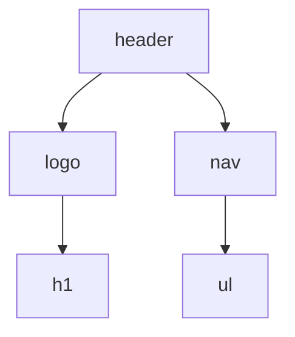

## Introduction

<div class="arabic">
في السيشن دي، ورينا إزاي نحول هيدر مكتوب بـ HTML و CSS لهيدر ديناميكي بالجافاسكريبت و DOM. يعني بدل ما تكتب الكود ثابت، تقدر تبنيه بالكود وانت شغال.
</div>

## Topic 1: The Original HTML Header Structure

This is the static HTML header we started with:

```html
<header>
    <div class="logo">
        <h1>Essential Science</h1>
    </div>
    <nav>
        <ul>
            <li><a href="Home.html" aria-current="page">Home</a></li>
            <li><a href="aboutus.html">About</a></li>
            <li><a href="tips.html">Tips</a></li>
            <li><a href="Devices.html">Devices</a></li>
            <li><a href="contact us.html">Contact</a></li>
            <li><a href="login.html">Login</a></li>
        </ul>
    </nav>
</header>
```

<div class="arabic">
دا الheader اللي بدأنا بيه، كله ثابت في الـ HTML.
</div>

## Topic 2: The CSS Styling for the Header

Here is the CSS that styles the header and its elements:

```css
header {
    height: 200px;
    display: flex;
    justify-content: space-between;
    align-items: center;
    background-color: var(--header-bg);
    color: var(--header-text);
    padding: 0 2rem;
    box-shadow: 0 2px 4px rgba(0, 0, 0, 0.1);
    position: relative;
    z-index: 1000;
}

header .logo {
    display: flex;
    align-items: center;
}

header .logo h1 {
    font-size: 1.8rem;
    font-weight: 700;
    color: var(--header-text);
    letter-spacing: 0.5px;
}

nav {
    height: 100%;
}

nav ul {
    list-style: none;
    display: flex;
    height: 100%;
    align-items: center;
    gap: 1rem;
}

nav ul li {
    height: 100%;
    display: flex;
    align-items: center;
}

nav ul li a {
    color: var(--header-text);
    text-decoration: none;
    font-size: 1.1rem;
    padding: 0.5rem 1rem;
    border-radius: 4px;
    transition: all 0.2s ease;
    position: relative;
}
```

<div class="arabic">
دا ال CSS اللي كنا عايزين نعمل زيه بالظبط بس بالجافاسكريبت.
</div>

## Topic 3: Building the Header Structure Dynamically with JavaScript

We built the header structure step by step, focusing on which element is the parent and which is the child, and how to use `appendChild` to build the hierarchy.

```javascript
let header = document.createElement('header');
header.style.height = '200px';
header.style.display = 'flex';

let logo = document.createElement('div');
logo.className = 'logo';

let nav = document.createElement('nav');

header.appendChild(logo); // header is parent of logo
header.appendChild(nav);  // header is parent of nav

let h1 = document.createElement('h1');
h1.textContent = 'Essential Science';
logo.appendChild(h1);    // logo is parent of h1

let ul = document.createElement('ul');
nav.appendChild(ul);     // nav is parent of ul

document.body.insertBefore(header, document.body.firstChild);
```

**Hierarchy Diagram:**



This shows how each element is nested inside its parent.

<div class="arabic">
هنا عملنا كل عنصر لوحده، وبعدين ركبناهم فوق بعض زي العرايس الخشب! كل واحد ليه parent و child. استخدمنا appendChild عشان نضيف كل عنصر جواه اللي بعده.
</div>

---

## Key Concepts Covered

<div class="arabic">
الحاجات المهمة اللي اتعلمناها في السيشن:
</div>

1. **DOM Manipulation**: إزاي تبني وتنسق عناصر الصفحة بالجافاسكريبت
2. **Translating HTML/CSS to JS**: إزاي تحول كود ثابت لحاجة ديناميكية بالكود
3. **Parent/Child Structure**: مين الأب ومين الابن في العناصر، وازاي تربطهم ببعض
