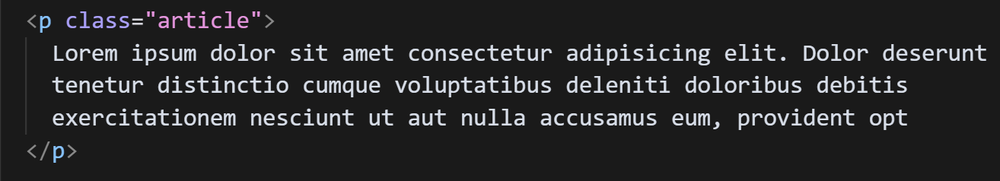

## Topic 1: What is CSS?

<div class="arabic">
مقدمة عن CSS: لغة التصميم  اللي هتخلي صفحات الويب تبقى جميلة وممتعة!
</div>

### Subtopic 1: Why Do We Need CSS?

**CSS Makes Websites Beautiful**

- CSS helps make web pages look amazing
- Separates content (HTML) from design (CSS)
- Lets you change colors, fonts, spacing, and backgrounds easily

<div class="arabic">
CSS بتخلي صفحات الإنترنت تبقى جذابة وسهلة القراءة.
</div>

---

## Topic 2: Ways to Add CSS

<div class="arabic">
هنتعلم 3 طرق عشان نضيف CSS لصفحاتنا:
</div>

### Subtopic 1: Inline CSS (داخل العنصر)

```html
<!-- طريقة مباشرة: تغيير لون النص مباشرة -->
<p style="color: red; background-color: blue;">نص ملون</p>
```

<div class="arabic">
استخدم خاصية style مباشرة جوة العنصر. 
</div>


### Subtopic 2: Internal CSS (داخل الصفحة)


```html
<head>
    <style>
        .article {
            color: green;
            background-color: yellow;
            border-radius: 15px;
            font-size: 20px;
        }
    </style>
</head>
```


#### لازم تكتب اسم class صح



<div class="arabic">
نكتب كود CSS داخل وسم style في راس الصفحة.
</div>

### Subtopic 3: External CSS (ملف خارجي)

```html
<head>
    <link rel="stylesheet" href="styles.css">
</head>
```

<div class="arabic">
نحط كود CSS في ملف منفصل..
</div>

---

## Topic 3: CSS Syntax & Selectors

### Subtopic 1: CSS Syntax (تركيب كود CSS)

```css
selector {
    property: value;
}
```

<div class="arabic">
كل قاعدة CSS زي وصفة طبخ:
- المُنتقي (selector): مين اللي هنغير عليه
- الخاصية (property): إيه اللي هنغيره
- القيمة (value): هنغيره لإيه
</div>

### Subtopic 2: Basic Selectors (المنتقيات الأساسية)

#### Element Selector (منتقي العنصر)

```css
p {
    color: red;
    background-color: blue;
    border-radius: 25px;
    font-size: 50px;
}
```

#### Class Selector (منتقي الفئة)

```css
.paragraph {
    color: green;
    background-color: yellow;
    border-radius: 15px;
    font-size: 20px;
}
```

<div class="arabic">
المنتقيات دي زي إزاي بنختار هدوم نلبسها. العنصر زي نوع الهدوم، والكلاس زي مقاس معين.
</div>

---

## Practical Exercise (تدريب عملي)

<div class="arabic">
هنعمل صفحة ويب جميلة ونطبق كل اللي اتعلمناه:

1. اعمل ملف HTML جديد
2. أضف عنوان رئيسي واستخدم inline CSS
3. اعمل فقرة بكلاس "paragraph" واستخدم internal CSS
4. أضف div بكلاس "container"
5. جرب تغيير الألوان والأحجام باستخدام DevTools
</div>

**Step-by-Step Instructions (English):**
1. Create a new HTML file
2. Add a main heading with inline CSS
3. Create a paragraph with class "paragraph" using internal CSS
4. Add a div with class "container"
5. Experiment with colors and sizes using DevTools

---

## Homework (واجب عملي)

<div class="arabic">
اعمل صفحة ويب إبداعية تظهر مهاراتك الجديدة في CSS:
- عنوان رئيسي
- فقرات بألوان مختلفة
- قائمة مرتبة وغير مرتبة
- استخدم كل طرق إضافة CSS
- جرب خصائص مختلفة زي الألوان والحدود
</div>

**Challenge Details:**
- Create a creative webpage
- Use different CSS methods
- Experiment with various properties
- Have fun designing!

---

## Useful Resources (مصادر مفيدة)

- [MDN Web Docs - CSS](https://developer.mozilla.org/en-US/docs/Web/CSS)
- [CSS-Tricks](https://css-tricks.com/)
- [Flexbox Froggy](https://flexboxfroggy.com/)
- [Can I Use](https://caniuse.com/)

<div class="arabic">
روابط هتساعدك تتعلم CSS بشكل أعمق وأحلى!
</div>

## CSS Attributes and Their Magic (خصائص CSS وتأثيراتها)

### Table of CSS Attributes

| Attribute | What It Does | Example from Demo | Arabic Explanation |
|-----------|--------------|-------------------|-------------------|
| `color` | Changes text color | `color: pink;` | بيغير لون الكتابة |
| `background-color` | Changes background color | `background-color: skyblue;` | بيغير لون الخلفية |
| `border` | Adds a border around an element | `border: 5px solid black;` | بيعمل إطار حوالين العنصر |
| `border-radius` | Rounds the corners of an element | `border-radius: 25px;` | بيعمل زوايا مستديرة |
| `font-size` | Changes the size of the text | `font-size: 30px;` | بيكبر أو يصغر حجم الكتابة |
| `padding` | Adds space inside the element | `padding: 10px;` | بيضيف مسافة جوة العنصر |
| `margin` | Adds space outside the element | `margin: 10px;` | بيضيف مسافة برة العنصر |
| `width` | Sets the width of an element | `width: 200px;` | بيحدد عرض العنصر |
| `font-family` | Changes the font type | `font-family: 'Times New Roman'` | بيغير نوع الخط |

### Code Examples from the Demo

#### Inline CSS Example
```html
<h1 style="color: lavender; background-color: violet; width: 200px">
    Title
</h1>
```

#### Internal CSS Example
```css
.article {
    color: pink;
    background-color: rgb(0, 200, 255);
    border-radius: 25px;
    font-size: 30px;
    border: 5px solid black;
    padding: 10px;
    margin: 10px;
}
```

<div class="arabic">
شوف الأمثلة دي وازاي CSS بتغير شكل الصفحة بطرق مختلفة. كل خاصية ليها سحرها الخاص!
</div>

---
