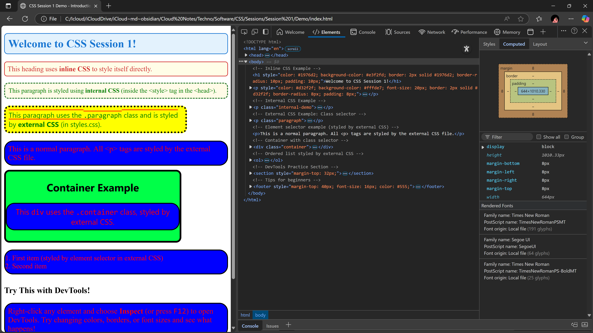

## Topic 1: Introduction to CSS (مقدمة عن CSS)

<div class="arabic">
مقدمة سريعة عن CSS: ليه بنستخدمها وإزاي بتخلينا نتحكم في شكل صفحات الويب.
</div>

### Subtopic 1: Why CSS? (ليه CSS؟)

- CSS بتخلي صفحات الويب أجمل وأسهل في القراءة.
- بتفصل بين المحتوى (HTML) والتصميم (CSS).
- تقدر تغير الألوان، الخطوط، المسافات، الخلفيات، وغيرهم بسهولة.

---

## Topic 2: Ways to Add CSS (طرق إضافة CSS)

<div class="arabic">
فيه 3 طرق رئيسية لإضافة CSS لصفحتك:
</div>

### Subtopic 1: Inline CSS (داخل العنصر)

```html
<p style="color: red; background-color: blue;">نص ملون</p>
```

<div class="arabic">
نستخدم خاصية style داخل العنصر نفسه.
</div>

### Subtopic 2: Internal CSS (داخل الصفحة)

```html
<head>
    <style>
        .paragraph {
            color: green;
            background-color: yellow;
            border-radius: 15px;
            border: 5px solid black;
            width: 500px;
            font-size: 20px;
            font-family: system-ui, -apple-system, BlinkMacSystemFont, 'Segoe UI', Roboto, Oxygen, Ubuntu, Cantarell, 'Open Sans', 'Helvetica Neue', sans-serif;
        }
    </style>
</head>
```

<div class="arabic">
نكتب كود CSS داخل وسم style في رأس الصفحة.
</div>

### Subtopic 3: External CSS (ملف خارجي)

```html
<head>
    <link rel="stylesheet" href="styles.css">
</head>
```

<div class="arabic">
نحط كود CSS في ملف منفصل ونربطه بالصفحة.
</div>

---

## Topic 3: CSS Syntax & Selectors (التركيب والانتقاء)

### Subtopic 1: CSS Syntax (تركيب كود CSS)

```css
selector {
    property: value;
}
```

<div class="arabic">
كل قاعدة CSS بتتكون من:
<ul>
  <li>المُنتقي (selector): بيحدد العنصر اللي هنطبّق عليه القاعدة.</li>
  <li>الخاصية (property): الحاجة اللي عايز تغيرها (زي اللون).</li>
  <li>القيمة (value): القيمة الجديدة للخاصية.</li>
</ul>
</div>

### Subtopic 2: Basic Selectors (المنتقيات الأساسية)

- **Element selector (منتقي العنصر):**
  - يختار كل العناصر من نوع معين.
  - مثال:

```css
p {
    color: red;
    background-color: blue;
    border: 3px solid black;
    border-radius: 25px;
    font-size: 50px;
}
```

- **Class selector (منتقي الفئة):**
  - يختار كل العناصر اللي عندها نفس الكلاس.
  - مثال:

```css
.paragraph {
    color: green;
    background-color: yellow;
    border-radius: 15px;
    border: 5px dotted black;
    width: 500px;
    font-size: 20px;
    font-family: system-ui, -apple-system, BlinkMacSystemFont, 'Segoe UI', Roboto, Oxygen, Ubuntu, Cantarell, 'Open Sans', 'Helvetica Neue', sans-serif;
    text-decoration: overline;
    text-decoration-color: red;
}
```

- **Another class example:**

```css
.container {
    background-color: rgb(0, 255, 72);
    width: 500px;
    height: 200px;
    border: 5px solid black;
    border-radius: 15px;
    text-align: center;
    font-size: 20px;
    font-family: system-ui, -apple-system, BlinkMacSystemFont, 'Segoe UI', Roboto, Oxygen, Ubuntu, Cantarell, 'Open Sans', 'Helvetica Neue', sans-serif;
}
```

- **Element selector for lists:**

```css
ol {
    color: red;
    background-color: blue;
    border: 3px solid black;
    border-radius: 25px;
    font-size: 50px;
}
```

<div class="arabic">
فيه منتقيات تانية زي ID (#idname) ونجربها في الجلسات الجاية.
</div>

---

## Table: CSS Properties Used in the Demo (جدول خصائص CSS المستخدمة)

| Property                | Example Value                                      | What it Does (English)         | شرح بالعربي                 |
|-------------------------|---------------------------------------------------|-------------------------------|-----------------------------|
| color                   | red, green                                        | Text color                    | لون النص                    |
| background-color        | yellow, blue, #e3f2fd, rgb(0,255,72)              | Background color               | لون الخلفية                 |
| border                  | 3px solid black, 5px dotted black                 | Border style, width, color     | إطار العنصر (سمك، نوع، لون) |
| border-radius           | 15px, 25px, 10px                                  | Rounded corners                | زوايا دائرية                |
| width                   | 500px, 200px                                      | Element width                  | عرض العنصر                  |
| height                  | 200px, 50px                                       | Element height                 | ارتفاع العنصر               |
| font-size               | 20px, 22px, 50px                                  | Text size                      | حجم الخط                    |
| font-family             | system-ui, Arial, ...                             | Font type                      | نوع الخط                    |
| text-decoration         | overline                                          | Text decoration (e.g. line)    | زخرفة النص (خط فوق)         |
| text-decoration-color   | red                                               | Color of text decoration       | لون الزخرفة                 |
| text-align              | center                                            | Horizontal text alignment      | محاذاة النص                 |
| padding                 | 8px, 10px, 10px 20px                              | Space inside element           | مسافة داخل العنصر           |
| margin-bottom           | 12px, 16px, 20px                                  | Space below element            | مسافة أسفل العنصر           |

---

## Topic 4: Inspecting with DevTools (استخدام أدوات المطور)

<div class="arabic">
أدوات المطور (DevTools) في المتصفح بتساعدك تشوف وتعدل CSS مباشرة.
</div>

### Subtopic 1: How to Open DevTools (إزاي تفتح أدوات المطور)

- اضغط F12 أو كليك يمين واختار "Inspect" أو "فحص".
- تقدر تشوف كل العناصر وكود CSS الخاص بيها.
- جرب تغير القيم وشوف النتيجة فورًا.




### Subtopic 2: Practice (تجربة عملية)

- افتح صفحتك وجرب تغير لون أو حجم عنصر من DevTools.
- لاحظ إن التغييرات مؤقتة (بتروح بعد ما تعيد تحميل الصفحة).

---

## Practical Exercise (تدريب عملي)

<div class="arabic">
اتبع الخطوات التالية لإنشاء صفحة HTML وتطبيق ما تعلمته:
<ol>
  <li>أنشئ ملف HTML جديد.</li>
  <li>أضف عنوان رئيسي (h1) واستخدم <b>inline CSS</b> لتغيير لونه وخلفيته.</li>
  <li>أضف فقرة (p) بكلاس "paragraph"، وطبق عليها <b>internal CSS</b> داخل وسم <code>&lt;style&gt;</code> في رأس الصفحة.</li>
  <li>أضف فقرة أخرى بدون كلاس، ولاحظ كيف تتأثر بخصائص <b>external CSS</b> (في ملف styles.css).</li>
  <li>أضف عنصر <code>div</code> بكلاس "container"، وطبق عليه خصائص CSS في ملفك الخارجي.</li>
  <li>أضف قائمة مرتبة (ol) فيها عنصرين على الأقل.</li>
  <li>جرب استخدام DevTools لتغيير لون أو حجم أي عنصر مباشرة من المتصفح.</li>
</ol>
</div>

**Step-by-step (English):**
1. Create a new HTML file.
2. Add a main heading (`<h1>`) and use <b>inline CSS</b> to change its color and background.
3. Add a paragraph (`<p>`) with class "paragraph" and style it using <b>internal CSS</b> in the `<style>` tag in the head.
4. Add another paragraph without a class and see how <b>external CSS</b> (in styles.css) affects it.
5. Add a `<div>` with class "container" and style it in your external CSS file.
6. Add an ordered list (`<ol>`) with at least two items.
7. Use DevTools to experiment with changing the color or size of any element directly in the browser.

---

## Homework (واجب عملي)

<div class="arabic">
اعمل صفحة HTML جديدة فيها:
<ul>
  <li>عنوان رئيسي</li>
  <li>فقرة بكلاس خاص</li>
  <li>قائمة مرتبة وغير مرتبة</li>
  <li>عنصر div بكلاس "container"</li>
  <li>استخدم كل طرق إضافة CSS (inline, internal, external)</li>
  <li>جرّب كل الخصائص اللي اتعلمتها (ألوان، خلفيات، حدود، زوايا دائرية، حجم الخط...)</li>
  <li>استخدم DevTools لتجربة تغييرات إضافية</li>
</ul>
</div>

**Real-life task:**
Create a new HTML page with:

- A main heading
- A paragraph with a special class
- Ordered and unordered lists
- A div with class "container"
- Use all three CSS methods (inline, internal, external)
- Try all the properties you learned (colors, backgrounds, borders, border-radius, font-size, etc.)
- Use DevTools to experiment with extra changes

---

## Useful Resources (مصادر مفيدة)

- [MDN Web Docs - CSS](https://developer.mozilla.org/en-US/docs/Web/CSS)
- [CSS-Tricks](https://css-tricks.com/)
- [Flexbox Froggy](https://flexboxfroggy.com/)
- [Can I Use](https://caniuse.com/)

<div class="arabic">
لو عايز تتعلم أكتر أو تجرب بنفسك، استخدم المصادر دي.
</div>
